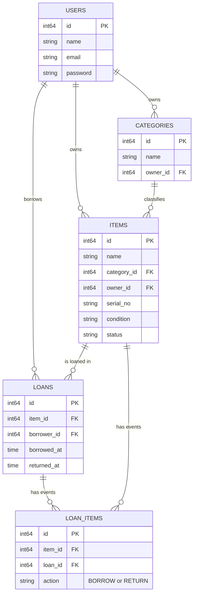

# go-lending-items

REST API for a peer-to-peer item lending system. Users can list items they own under categories, and other users can borrow and return those items, with every borrow/return event recorded as history.

## Tech stack

- Go 1.26, `net/http` (stdlib router, no framework)
- MySQL via GORM
- JWT authentication (`golang-jwt/jwt`)
- Swagger docs via `swaggo/swag` + `swaggo/http-swagger`
- Config via `spf13/viper` (`.env` file)

## Project structure

Layered architecture: `controller` (HTTP handlers) → `service` (business logic) → `repository` (GORM queries), with shared `model` structs and `helper` utilities.

```
config/       DB connection, env config, GORM AutoMigrate
model/        entity structs (User, Category, Item, Loan, LoanItem)
repository/   data access per entity
service/      business logic per entity
controller/   HTTP handlers per entity
middleware/   CORS and JWT auth middleware
helper/       response writers, error handling, validation, JWT
docs/         generated Swagger spec
cmd/migrate/  standalone DB migration runner
```

## Setup

1. Copy `.env.example` to `.env` and fill in your database credentials and a JWT secret:
   ```
   DB_HOST=localhost
   DB_PORT=3306
   DB_USERNAME=
   DB_PASSWORD=
   DB_NAME=loans_item_golang
   JWT_SECRET=gantidengansecretyangpanjang
   APP_PORT=8000
   ```
2. Run database migrations (creates tables via GORM `AutoMigrate`):
   ```
   go run cmd/migrate/main.go
   ```
3. Start the server:
   ```
   go run main.go
   ```
4. Swagger UI is available at `http://localhost:8000/swagger/`.

## Authentication

Register and log in via `/api/users/register` and `/api/users/login`. Login returns a JWT; send it as `Authorization: Bearer <token>` on every other endpoint. In Swagger UI, use the "Authorize" button to set this header.

## API overview

| Resource | Endpoints |
|---|---|
| Users | `POST /api/users/register`, `POST /api/users/login`, `GET /api/users`, `GET /api/users/{id}`, `PUT /api/users/{id}`, `DELETE /api/users/{id}` |
| Categories | `POST /api/categories`, `GET /api/categories`, `GET /api/categories/{id}`, `PUT /api/categories/{id}`, `DELETE /api/categories/{id}` |
| Items | `POST /api/items`, `GET /api/items`, `GET /api/items/owner/{ownerId}`, `GET /api/items/{id}`, `PUT /api/items/{id}`, `DELETE /api/items/{id}` |
| Loans | `POST /api/loans` (borrow), `GET /api/loans`, `GET /api/loans/{id}`, `GET /api/loans/borrower/{borrower_id}`, `PUT /api/loans/{id}` (return), `DELETE /api/loans/{id}` |

## Database schema



`loan_items` is an append-only history log: every borrow creates a `BORROW` row and every return creates a new `RETURN` row (instead of mutating the original), so the full borrow/return timeline per loan is preserved rather than overwritten.
